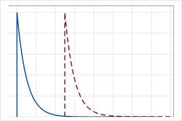
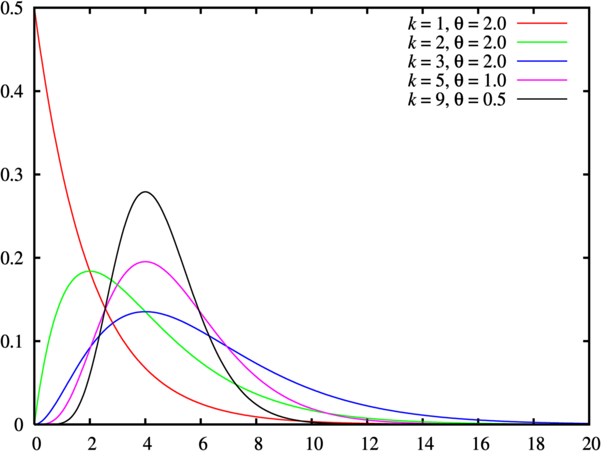
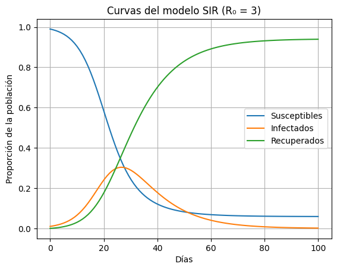

# **Laboratorio**
### **Modelación y Simulación**
### **Sección 20**

- Monica Salvatierra - 22249
- Derek Arreaga - 22537
- Paula Barillas - 22764

>Link del repositorio: https://github.com/FabianKel/ModSim-LAB2

### **Partes Prácticas:**
- [Ejercicio 1](Ejercicio1.ipynb)
- [Ejercicio 2](Ejercicio2.ipynb)
- [Ejercicio 3](Ejercicio3.ipynb)
---
## **Ejercicio 1**
### **Teoría**

#### 1. **Defina un retardo de primer orden y explique sus dos formulaciones**

Un retardo de primer orden es un sistema dinámico que se caracteriza por tener un solo polo en su función de transferencia como también es importante mencionar que es representado por ecuaciones diferenciales de primer orden. Donde el máximo orden de su derivada es de uno, presentando una respuesta exponencial.

- Estar representado por ecuaciones diferenciales ordinarias de **primer orden**
- El máximo orden de la derivada es **1**
- Presenta una respuesta exponencial característica

##### **Formulaciones**

**a. Formulación Matemática General (Dominio del Tiempo)**
$$
a_1\frac{dy(t)}{dt} + a_0y(t) = b_0u(t)
$$
**Condiciones iniciales:** $y(0) = 0$

**Donde:**
- $y(t)$ = Variable de salida (respuesta del sistema)
- $u(t)$ = Variable de entrada (señal de excitación)
- $a_1, a_0, b_0$ = Coeficientes constantes del sistema

**b. Función de Transferencia (Dominio de Laplace)**
$$
H(s) = \frac{K}{(τs + 1)} × e^{-θs}
$$

**Parámetros del Sistema:**
- **$K$** = Ganancia estática del sistema (amplificación en estado estacionario)
- **$τ$** = Constante de tiempo del sistema (tiempo característico de respuesta)
- **$θ$** = Retardo de tiempo del sistema (tiempo muerto o delay)
- **$s$** = Variable compleja de Laplace

**Aplicaciones Comunes**
- Sistemas térmicos (calentamiento/enfriamiento)
- Circuitos RC
- Tanques con mezcla perfecta
- Procesos de población
- Sistemas de inventario

#### 2. **Seguimiento de flujo (salida = stock/retardo)**

En el seguimiento de flujo, la  salida del sistema es proporcional al stock actual dividido por el tiempo de retardo. Esta relación se expresa como:

$$Salida(t) = \frac{Stock(t)}{Retardo}$$


| Variable | Efecto en la Salida | Explicación |
|----------|-------------------|-------------|
| **↑ Stock** | **↑ Salida** | Mayor inventario → mayor flujo de salida |
| **↑ Retardo** | **↓ Salida** | Mayor tiempo de proceso → menor flujo de salida |


Donde hay una relación directamente proporcional al nivel del stock actual, donde es inversamente proporcional al tiempo de retardo. Asímismo el sistema tiende naturalmente hacia el equilibrio

**Ecuación Diferencial**
$$
d(Stock)/dt = Entrada - (Stock/Retardo)
$$
Un ejemplo puede ser un inventario. 

**Inventario de productos**:
   - Stock = Productos en almacén
   - Salida = Ventas proporcionales al inventario disponible

**Tomando en cuenta un comportamiento dinámico:**
- **Estado inicial**: Si Stock(0) $≠$ Equilibrio
- **Transición**: Ajuste exponencial hacia el equilibrio
- **Estado final**: Stock_equilibrio = Entrada $×$ Retardo

#### 3. **Búsqueda de objetivo (flujo = (objetivo - stock)/retardo)**

Esta formulación representa un **sistema de control** que busca alcanzar un objetivo específico mediante un mecanismo de retroalimentación negativa:

$$
Flujo = \frac{Objetivo - Stock}{Retardo}
$$

| Condición | Flujo | Comportamiento | Resultado |
|-----------|-------|---------------|-----------|
| **Stock $<$ Objetivo** | **Positivo ($+$)** | Entrada al sistema | Se acerca al objetivo |
| **Stock $>$ Objetivo** | **Negativo ($-$)** | Salida del sistema | Se aleja del exceso |
| **Stock $=$ Objetivo** | **Cero ($0$)** | Equilibrio | Se mantiene estable |

En este caso, el flujo es proporcional al error ($Objetivo - Stock$) , donde Mayor error → Mayor flujo correctivo . Como también es importante mencionar que tiene una estabilidad en el que converge naturalmente al objetivo 

 **Ecuación Diferencial**
$$
\frac{d(Stock)}{dt} = Flujo = \frac{Objetivo - Stock}{Retardo}
$$

**Solución analítica:**
$$
Stock(t) = Objetivo + (Stock_0 - Objetivo) × e^{\frac{-t}{Retardo}}
$$

Ejemplo del inventario. 

**Control de inventario**: 
   - Objetivo = Nivel de inventario deseado
   - Flujo = Órdenes de compra/venta


**Parámetros de Rendimiento**

| Parámetro | Descripción | Fórmula |
|-----------|-------------|---------|
| **Tiempo de establecimiento** | **98%** del objetivo | $ts ≈ 4 × Retardo$ |
| **Constante de tiempo** | **63.2%** del objetivo | $τ = Retardo$ |
| **Sobreimpulso** | Sin sobreimpulso | **0%** (sistema de 1er orden) |
| **Error en estado estacionario** | Error final | **0** (sistema tipo 1) |


#### 4. **Describa la condición de equilibrio (entrada = salida) y cómo los stocks se ajustan exponencialmente.**

En equilibrio, el sistema alcanza un estado estable donde:

```python
Entrada = Salida

Entrada = Stock_equilibrio / Retardo
Stock_equilibrio = Entrada * Retardo
```

**Para búsqueda de objetivo:**
```python
Stock_equilibrio = Objetivo
```

**Ajuste Exponencial**

Los stocks se ajustan siguiendo una función exponencial que es  característica de los sistemas de primer orden:

**Respuesta al escalón (desde cero):**
$$
y(t) = K(1 - e^{\frac{-t}{τ}})
$$

**Respuesta general (con condición inicial):**
$$
y(t) = y_{equilibrio} + (y_0 - y_{equilibrio}) × e^{(-t/τ)}
$$

**Parámetros Clave del Ajuste**

| Parámetro | Valor | Significado |
|-----------|-------|-------------|
| **τ (constante de tiempo)** | $Retardo$ | Tiempo para alcanzar **63.2%** del valor final |
| **Tiempo de establecimiento** | $4τ$ | Tiempo para alcanzar **98%** del valor final |
| **Tiempo de subida** | $2.2τ$ | Tiempo para ir del **10%** al **90%** |
| **Velocidad inicial** | $\frac{y_{final} - y_0}{τ}$ | Pendiente inicial de la respuesta |

**Características de la Respuesta Exponencial**


| Tiempo | % del Valor Final Alcanzado |
|--------|----------------------------|
| **t = τ** | 63.2% |
| **t = 2τ** | 86.5% |
| **t = 3τ** | 95.0% |
| **t = 4τ** | 98.2% |
| **t = 5τ** | 99.3% |

Ejemplo: 

**Tanque de agua**
- **$τ = 10 min$** → **63.2**% del nivel final en **10** minutos
- **$ts = 40 min$** → Prácticamente estable en **40** minutos


#### 5. **Explique por qué los sistemas lineales permiten la superposición (las soluciones se pueden sumar).**

Los sistemas lineales permiten la superposición porque las derivadas son operaciones lineales

$$
\frac{d}{dt(x + y)} = \frac{dx}{dt} + \frac{dy}{dt}
$$
$$
\frac{d}{dt(ax)} = a × \frac{dx}{dt}
$$

Si $y_1(t)$ y $y_2(t)$ son soluciones individuales del sistema lineal, entonces:

$$
y_{total}(t) = a_1 × y_1(t) + a_2 × y_2(t)
$$
Siendo también es una solución válida para cualquier constante $a_1$ y $a_2$.  De las caracteristicas de la superposición es que tiene dependencia ya que las soluciones no se interfieren como tambien todo $=$ suma de las partes, es escalado proporcional y hay mezcla de soluciones. 

En el caso de la linealidad tiene ventajas como el resolver problemas complejos por partes, teniendo un comportamiento determinístico.

**Técnicas Habilitadas por la Superposición**

**1. Diagonalización matricial**
$$
A = PDP^{-1}
$$
$$
Solución: x(t) = Pe^{Dt}P^{-1}x_0
$$

**2. Transformada de Laplace**
$$
L{f₁ + f₂} = L{f₁} + L{f₂}
$$

**3. Análisis modal**
$$
Respuesta total = Σ(modos individuales)
$$

**Ejemplo Práctico: Sistema RC**

$$Circuito RC: τ(\frac{dv}{dt}) + v = u(t)$$
$$Entrada 1: u_1(t) = escalón \rightarrow v-1(t) = V(1 - e^{-\frac{t}{τ}})$$
$$Entrada 2: u_2(t) = rampa → v_2(t) = Rt - Rτ(1 - e^{\frac{-t}{τ}})$$
$$Entrada combinada: u_1 + u_2 → v_1 + v_2$$

#### 6. **Dado un stock con un valor inicial de 100, una entrada de 5/día y un retraso de 10 días:**

**Datos utilizados**
- **Stock inicial**: **100** unidades
- **Entrada**: **5** unidades/día  
- **Retardo**: **10** días
**a. Calcule el valor de equilibrio del stock**

**Solución:**
En equilibrio: $Entrada = Salida$

```python
Salida = Stock_equilibrio / Retardo
5 = Stock_equilibrio / 10
Stock_equilibrio = 5 × 10 = 50 unidades
```
El stock de equilibrio es 50 unidades

**b. Dibuje la trayectoria del stock a lo largo del tiempo**

**Análisis:**
- Stock inicial (**100**) > Stock equilibrio (**50**)
- El stock **disminuirá exponencialmente** desde **100** hacia **50**
- Ecuación: $Stock(t) = 50 + (100-50)e^{-\frac{t}{10}} = 50 + 50e^{-\frac{t}{10}}$


**Puntos clave:**

| Tiempo (días) | Stock (unidades) | % hacia equilibrio |
|---------------|------------------|-------------------|
| t = 0 | 100 | 0% |
| t = 10 | 68.4 | 63.2% |
| t = 20 | 56.8 | 86.5% |
| t = 30 | 52.5 | 95.0% |
| t = 40 | 50.9 | 98.2% |


**c. Compare los retrasos sin memoria y los retrasos por etapas**

**Retrasos sin memoria (Exponenciales)**

| Característica | Descripción |
|----------------|-------------|
| **Distribución** | Exponencial del tiempo de permanencia |
| **Comportamiento** | Algunos elementos salen inmediatamente, otros permanecen mucho tiempo |
| **Variabilidad** | Alta dispersión en tiempos de salida |
| **Modelo matemático** | $P(t) = (\frac{1}{τ})e^{-\frac{t}{τ}}$ |



** Retrasos por etapas (Distribución de Erlang)**

| Característica | Descripción |
|----------------|-------------|
| **Distribución** | Erlang (gamma con parámetros enteros) |
| **Comportamiento** | Más concentrada alrededor del tiempo medio |
| **Variabilidad** | Menor dispersión, más predecible |
| **Modelo matemático** | $$P(t) = \frac{(λ^n × t^{n-1} × e^{-λt})}{ (n-1)!}$$ |



**Parámetros comparativos**

| Métrica | Exponencial | Erlang (n=3) | Erlang (n=5) |
|---------|-------------|-------------|-------------|
| **Media** | $$τ$$ | $$τ$$ | $$τ$$ |
| **Varianza** | $$τ^2$$ | $$\frac{τ^2}{3}$$ | $$\frac{τ^2}{5}$$ |
| **Coef. variación** | **$$1.0$$** | **$$0.58$$** | **$$0.45$$** |
| **Forma de curva** | Decreciente | Campanada | Más estrecha |

---
## **Ejercicio 2**
### **Teoría**

Responda las siguientes preguntas de forma clara

#### 1. **Explique cómo los retrasos en la percepción causan oscilaciones (p. ej., analogía del termostato).**
<br>
<br>
    Cuando existe un retraso en lo que sucede en la realidad y lo que el sistema percibe, puede que se lleguen a tomar decisiones que ya no son adecuadas para el momento actual. Un posible ejemplo para ilustrar esta idea es la analogía del termostato. Si un termostato tarda en tomar la temperatura de un cuarto, podría seguir calentando el ambiente aunque la temperatura ya haya llegado al nivel de calefacción deseado. Como está reaccionando con información atrasada, puede llegar a calentar de más y luego tener que enfriar. Este comportamiento es oscilatorio, puesto que ocurren cuando las decisiones se basan en datos que no reflejan el estado actual del sistema, generando ajustes tardíos que empeoran la estabilidad del sistema.
    
#### 2. **Deduzca por qué bucles de equilibrio + retrasos → sobreimpulso/insuficiencia.**
<br>
Los bucles de equilibrio son mecanismos que ayudan a que un sistema se mantenga estable, es decir, que regrese a un estado deseado cuando hay una desviación. Por ejemplo, si la inflación sube demasiado, el banco central puede subir las tasas de interés para bajarla y así volver al equilibrio.
<br><br>
Sin embargo, cuando este tipo de sistema tiene retrasos, tanto en la percepción del problema como en la aplicación de la solución, se generan respuestas que no coinciden con lo que el sistema realmente necesita en ese momento. Como resultado, se puede reaccionar con demasiada fuerza (sobreimpulso) o con muy poca intensidad (insuficiencia). Esto causa que el sistema pierda su capacidad para autorregularse correctamente.
<br><br>    
El sobreimpulso ocurre cuando el sistema todavía cree que el problema sigue ahí, cuando en realidad ya empezó a corregirse por sí solo o por acciones anteriores. Entonces se aplica una medida adicional que ya no era necesaria, y eso provoca que ahora el sistema se desvíe en la otra dirección. Luego, para corregir esa nueva desviación, se aplica otra acción… y así sucesivamente, causando inestabilidad.
<br><br>    
Por otro lado, la insuficiencia pasa cuando la acción es muy débil o llega tan tarde que no logra contrarrestar el problema a tiempo, y el sistema sigue alejándose del equilibrio. 

#### 3. **Analice y discuta ejemplos reales (ciclos económicos, respuestas a pandemias).**
<br>
Un ejemplo muy claro de cómo los retrasos y los bucles de equilibrio pueden causar oscilaciones en la vida real son los ciclos económicos. En teoría, cuando la economía está en recesión, los gobiernos o bancos centrales aplican medidas para estimularla, como bajar las tasas de interés o aumentar el gasto público. El problema es que estas medidas no tienen un efecto inmediato; su impacto puede tardar semanas o incluso meses en sentirse en la economía real.
<br><br>
Entonces, muchas veces cuando las políticas empiezan a hacer efecto, la economía ya estaba comenzando a recuperarse por sí sola. Como resultado, el estímulo adicional hace que se pase del punto de equilibrio y se genere un exceso de crecimiento o inflación. Después, el gobierno tiene que tomar nuevas medidas para frenar ese exceso, y ese patrón se repite una y otra vez, generando subidas y bajadas constantes en la actividad económica. Es decir, en lugar de estabilizar la economía, los retrasos hacen que las decisiones terminen amplificando las variaciones del sistema.
<br><br>
Otro caso muy evidente fue durante la pandemia del COVID-19. Al principio, muchos países tardaron en reaccionar porque no tenían datos suficientes o confiables sobre la velocidad de transmisión del virus. Esos días o semanas de retraso en la toma de decisiones hicieron que los contagios se salieran de control en varios lugares. Cuando por fin se aplicaron medidas como cuarentenas o restricciones de movilidad, el número de casos ya había aumentado considerablemente. Luego, cuando los casos bajaron, también hubo retraso en relajar las restricciones, lo que causó descontento social y afectó la economía. Todo eso generó una especie de "efecto rebote", donde los gobiernos iban corriendo detrás del problema, sin poder estabilizarlo del todo.

#### 4. **Para una acción con un objetivo de 100 y un retraso en la percepción de 20 días:**
<br>

**a. Prediga la magnitud del sobreimpulso si el retraso del ajuste es de 10 días.**
- Si se tarda 20 días en notar lo que está pasando y luego 10 días en hacer el ajuste, estamos actuando con 30 días de retraso total. Eso significa que cuando reaccionamos, la situación real ya ha cambiado mucho. Este desfase probablemente causará un sobreimpulso fuerte, porque se tomará una medida basada en un dato que ya no es válido. Entonces, se corrige demasiado, y después se tendrá que volver a corregir en la dirección contraria.

**b. ¿Cómo podría una recopilación más rápida de datos reducir las oscilaciones de las políticas?**
- Si los datos se recopilan más rápido, la información sobre lo que está pasando es más actual. Esto permite que las decisiones se basen en la realidad más cercana, no en lo que pasó hace semanas. Como resultado, las acciones pueden ser más precisas, evitando esos ajustes exagerados. En pocas palabras, menos retraso en los datos significa menos sobreimpulso y políticas más estables.

---
## **Ejercicio 3**
### **Teoría**

Responda las siguientes preguntas de forma clara

#### 1. Compare sistemas lineales y no lineales (p. ej., modelo SIR: $βSI$ vs. recuperación lineal $μ/I$).
<center>

| **Sistemas Lineales** | **Sistemas No Lineales** |
| --------------------- | ------------------------ |
| Relación directa entre causa y efecto. | Relación dependiente de múltiples variables entre sí.|
| Tienen soluciones analíticas cerradas.| Requieren simulación numérica.|
| Ejemplo: recuperación lineal:  **μ·I**| Ejemplo: infección no lineal: **β·S·I** |
| No generan comportamientos complejos como picos o ciclos. | Pueden generar picos epidémicos y dinámicas impredecibles. |


</center>


#### 2. **Defina la fuerza de infecciónn $(λ = \frac{βcI}{N})$ y su doble interpretación.**

a. **Riesgo por susceptibilidad**
- Es la probabilidad de que una persona susceptible entre un contacto con un infectado y se contagie. El resultado depende del número de infectados y de cuántos contactos tiene cada persona.

b. **Tasa de propagación por infección:**
- Es la tasa total a la que los individuos susceptibles se convierten en infectados en toda la población.

#### 3. **Explique por qué los sistemas no lineales requieren simulación (no se requieren soluciones de forma cerrada).**
- Los sistemas no lineales no tienen una solución simple algebráica simple ya que las variables se multiplican entre sí, y la evolución de cada variable depende del valor de todas las demás en cada isntante.

#### 4. **Para un modelo SIR con $R_0 = 3$:**

a. Explique que es $R_0$
- Es el número promedio de personas que una persona infectada puede contagiar en una población, en este caso con el valor de **3** significa que en promedio, cada persona infectada transmite la enfermedad a **3** personas al inicio de la epidemia. Para esta variable, si $R_0 > 1$ significa que la epidemia puede crecer, mientras que para $R_0 < 1$ significa que la epidemia tenderá a extinguirse.

b. Calcule el umbral de inmunidad de grupo.
- El umbral de inmunidad del grupo se calcula con la siguiente operación:
        $$
        Umbral = 1 - \frac{1}{R_0} = 1 - \frac{1}{3} = \frac{2}{3} = {\bf 66.7\%}
        $$

c. Dibuje las curvas epidémicas esperadas para $S$, $I$, $R$.



* En el gráfico se observa que:
  - **S(t)** disminuye
  - **I(t)** crece hasta llegar un pico, para luego bajar
  - **R(t)** crece con el tiempo

d. ¿Por qué el término $βSI$ crea puntos de inflexión?
- Esto es porque **S** e **I** cambian constantemente, y como el término es una multiplicación que crea una retroalimentación no líneal: Primero hay muchos susceptibles y pocos infectados, pero la infección crece exponencialmente. Luego al disminuir los susceptibles, el crecimiento se desacelera hasta que comienza a bajar. Es entonces ese cambio el que causa el punto de inflexión.
---
## **Referencias**
- Osgood, N. D. (2024). CMPT 394/858: Introduction to dynamic modeling. University of Saskatchewan. 24
- Alfredo, A. U. I., Raúl, G. D., & Wilfredo, M. L. (2021, 5 febrero). El modelo SIR básico y políticas antiepidémicas de salud pública para la COVID-19 en Cuba. https://www.scielosp.org/article/rcsp/2020.v46suppl1/e2597/
- Jim Frost (2022). Statistics By Jim. The Difference between Linear and Nonlinear Regression Models. https://statisticsbyjim.com/regression/difference-between-linear-nonlinear-regression-models/
